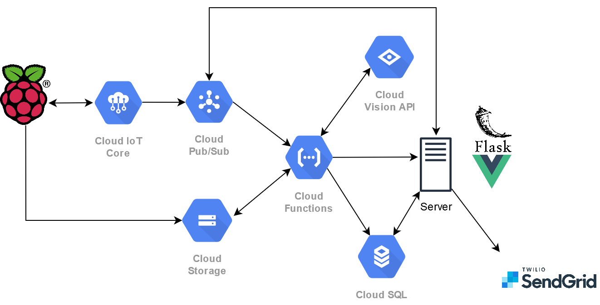

# Alarmy

Alarmy: Home Monitoring/Security System. It is able to monitor temperature, as well as concentration of gases in the air e.g Carbon Monoxide. Alarmy is also able to detect humans and trigger alerts.

## System Architecture 

## Project Structure
The project is broken down into 4 folders
- [agent](./agent): Hardware setup and configuration of Raspberry Pi and its sensors used for this project
- [backend](./backend): Flask backend 
- [cloudfuncs](./cloudfuncs): Python files for that is used in the GCP cloud functions
- [frontend](./frontend): Vue.js frontend

## Quick start
1. Run gcp_setup.sh in [cloudfuncs](./cloudfuncs)
2. Run setup.sh in this directory
